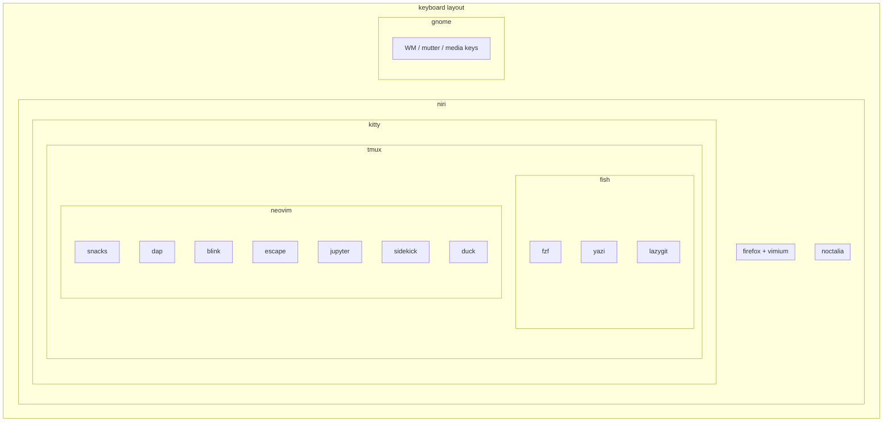

# Keybindings

This document lists all keybind configuration files organized by activation hierarchy.

## Hierarchy diagram



## Pyramid structure

```
LEVEL 1 — Keyboard Layout (always active, hardware remap layer)
  nix/keyboard/qwerty_rnk:41           English + special chars + modifier remaps
  nix/keyboard/jcuken_rnk:41           Russian + same special chars + modifier remaps
  nix/configuration.nix:120             NixOS XKB registration
  │
  ├─► Remaps every physical key. CapsLock→Ctrl, RWIN→Alt, LAlt→Level3, RCTL→Super.
  │   Special chars (§$% etc.) on 3rd/4th levels. Everything below operates on top
  │   of this remapping.
  │
  ▼
LEVEL 2 — Compositor (active whenever logged in; mutually exclusive)
  │
  ├── Niri (active) ───────────────────────────────────────
  │   .../configs/.config/niri/config.kdl:33    main binds
  │   .../configs/.config/niri/config.kdl:257   Alt+Tab switching
  │     │
  │     ├─► Alt+1→kitty, Alt+2→firefox, Alt+5→nautilus.
  │     │   Alt+№→launcher, Alt+4→settings, Alt+Tab→alt-tab.
  │     │   Alt+HJKL→focus, Ctrl+Alt+HJKL→resize columns,
  │     │   Ctrl+Alt+AWSD→move columns/monitors,
  │     │   Ctrl+Space→switch layout, Print→screenshot.
  │     │   Media keys: volume, playback, brightness.
  │     │
  │     ├── noctalia (popup layer on top of niri) ─────────
  │     │   .../noctalia/settings.json:385   UI navigation
  │     │   .../noctalia/settings.json:522   session menu
  │     │     │
  │     │     └─► Ctrl+N/J/P/K in menus. L/S/H/O/R/U/B/D
  │     │         power actions in session menu.
  │     │
  │     └── Level 3 apps ── (see below) ───────────────────
  │
  └── GNOME (legacy, alternative to niri) ──────────────────
      .../dconf.nix:211       WM keybindings
      .../dconf.nix:328       Mutter keybindings
      .../dconf.nix:334       Wayland restore-shortcuts
      .../dconf.nix:360       media keys & custom
      .../dconf.nix:408       shell keybindings
        │
        └─► Close/min/max, workspace nav, tiling, input
            source switching.


LEVEL 3 — Applications (peers, active when focused)
  │
  ├── Firefox ─────────────────────────────────────────────
  │   .../browsers/vimium.json:4       Vimium mappings
  │   .../browsers/browsers.nix:19     Ctrl+N removed
  │     │
  │     └─► C-d/C-u scroll, H/L tabs, C-o/C-i back/forward,
  │         o/j/k/l/h scroll, link hints, find, marks,
  │         vomnibar. Full Cyrillic equivalents via custom
  │         keyboard layout 1:1 remap.
  │
  └── Kitty (terminal, no custom keybinds) ─────────────────
        │
        ├── tmux (multiplexer inside kitty) ────────────────
        │   .../tmux/tmux.conf:12     pane/window/session
        │   .../tmux.nix:18           prefix C-s, triggers
        │     │
        │     └─► Prefix C-s. Ctrl+HJKL smart pane nav
        │         (passes through to neovim). "/_(/) resize
        │         10-15px. H/J/K/L 1px resize.
        │         Ctrl+N/P next/prev window.
        │         Ctrl+G toggle pane. Ctrl+F fingers,
        │         Ctrl+D jump. c new-window, |/- split.
        │
        ├── fish (shell) ───────────────────────────────────
        │   .../shell_utils.fish:2     C-d del, C-w kill-word
        │     │
        │     ├── fzf (popup overlay) ──────────────────────
        │     │   .../fzf.nix:77       internal binds
        │     │   .../fzf.nix:287      default opts
        │     │   .../fzf.nix:314      file widget
        │     │   .../fzf.nix:319      shell launcher
        │     │     │
        │     │     └─► C-r history, C-t files, C-o nix,
        │     │         C-q ripgrep, C-v tldr, C-x processes.
        │     │         Inside fzf: C-u/d half-page,
        │     │         C-b/f preview, C-g toggle preview.
        │     │
        │     ├── yazi (file manager TUI) ──────────────────
        │     │   .../yazi.nix:14      internal keymap
        │     │   .../yazi.nix:54      shell launcher
        │     │
        │     └── lazygit (git TUI) ────────────────────────
        │         .../lazygit.nix:14   internal overrides
        │         .../lazygit.nix:28   shell launcher
        │
        ├── neovim (editor) ─────────────────────────────────
        │   │
        │   ├── Core ───────────────────────────────────────
        │   │   .../keymaps.lua:143  C-z disable, 3× scroll,
        │   │                         sort, C-q layout toggle
        │   │
        │   └── Plugins ────────────────────────────────────
        │       .../init.lua:13      plugin key imports
        │         │
        │         ├── snacks.lua:53     picker, explorer,
        │         │                     terminals, lazygit
        │         ├── tmux.lua:3        pane nav C-hjkl,
        │         │                     resize A-z hjkl
        │         ├── dap.lua:6         debugger (all A-*)
        │         ├── blink.lua:61      completion C-k/d/u
        │         ├── better_escape.lua:87  sf→Esc
        │         ├── ipynb.lua:12      REPL, cell nav
        │         ├── sidekick.lua:3    AI toggle
        │         ├── duck.lua:3        duck companion
        │         └── edgy.lua:5        sidebar (DISABLED)
        │
        └── Reference docs ─────────────────────────────────
            .../keymaps.lua:5    master reserved keys
            .../shell.nix:16     Ctrl-key map
```

## Reference table

| Environment | Configuration |
|---|---|
| Niri compositor (all binds) | [`config.kdl:33`](nix/home-manager/programs/desktop-envs/configs/.config/niri/config.kdl) |
| Noctalia-shell (UI navigation) | [`settings.json:385`](nix/home-manager/programs/desktop-envs/noctalia/settings.json) |
| Noctalia-shell (session menu) | [`settings.json:522`](nix/home-manager/programs/desktop-envs/noctalia/settings.json) |
| GNOME (WM, Mutter, media, custom, shell) | [`dconf.nix:211`](nix/home-manager/programs/desktop-envs/dconf.nix) |
| Keyboard layout English (XKB) | [`qwerty_rnk:41`](nix/keyboard/qwerty_rnk) |
| Keyboard layout Russian (XKB) | [`jcuken_rnk:41`](nix/keyboard/jcuken_rnk) |
| NixOS XKB registration | [`configuration.nix:120`](nix/configuration.nix) |
| Firefox Vimium | [`vimium.json:4`](nix/home-manager/programs/browsers/vimium.json) |
| Firefox Ctrl+N disabled | [`browsers.nix:19`](nix/home-manager/programs/browsers/browsers.nix) |
| Tmux (pane, window, session, resize) | [`tmux.conf:12`](nix/home-manager/programs/shell/tmux/tmux.conf) |
| Tmux (prefix, plugin triggers) | [`tmux.nix:18`](nix/home-manager/programs/shell/tmux.nix) |
| Neovim core (scroll, sort, layout toggle) | [`keymaps.lua:143`](nix/home-manager/programs/text-editors/neovim/config/lua/config/keymaps.lua) |
| Neovim plugin imports | [`init.lua:13`](nix/home-manager/programs/text-editors/neovim/config/lua/plugins/init.lua) |
| Neovim Snacks (picker, explorer, terminals) | [`snacks.lua:53`](nix/home-manager/programs/text-editors/neovim/config/lua/plugins/configs/snacks.lua) |
| Neovim tmux-nvim (pane nav, resize) | [`tmux.lua:3`](nix/home-manager/programs/text-editors/neovim/config/lua/plugins/configs/tmux.lua) |
| Neovim DAP (debugger controls) | [`dap.lua:6`](nix/home-manager/programs/text-editors/neovim/config/lua/plugins/configs/dap.lua) |
| Neovim Blink (autocompletion) | [`blink.lua:61`](nix/home-manager/programs/text-editors/neovim/config/lua/plugins/configs/blink.lua) |
| Neovim better-escape (`sf` → `Esc`) | [`better_escape.lua:87`](nix/home-manager/programs/text-editors/neovim/config/lua/plugins/configs/better_escape.lua) |
| Neovim Jupyter (REPL, cell nav) | [`ipynb.lua:12`](nix/home-manager/programs/text-editors/neovim/config/lua/plugins/configs/ipynb.lua) |
| Neovim Sidekick (AI toggle) | [`sidekick.lua:3`](nix/home-manager/programs/text-editors/neovim/config/lua/plugins/configs/sidekick.lua) |
| Neovim duck (fun companion) | [`duck.lua:3`](nix/home-manager/programs/text-editors/neovim/config/lua/plugins/configs/duck.lua) |
| Neovim Edgy (sidebar resize, disabled) | [`edgy.lua:5`](nix/home-manager/programs/text-editors/neovim/config/lua/plugins/configs/edgy.lua) |
| Fish shell (line editing) | [`shell_utils.fish:2`](nix/home-manager/programs/shell/fish/conf.d/shell_utils.fish) |
| FZF (all shells: fish, bash, zsh, nushell) | [`fzf.nix:77`](nix/home-manager/programs/shell/fzf.nix) |
| Lazygit (internal + shell launchers) | [`lazygit.nix:14`](nix/home-manager/programs/vcs/lazygit.nix) |
| Yazi (file manager + shell launchers) | [`yazi.nix:14`](nix/home-manager/programs/fs-navigation/yazi.nix) |
| Shell Ctrl-key reference | [`shell.nix:16`](nix/home-manager/programs/shell/shell.nix) |
| Neovim reserved key reference (doc only) | [`keymaps.lua:5`](nix/home-manager/programs/text-editors/neovim/config/lua/config/keymaps.lua) |

Common prefix for paths shortened with `.../`:
- `nix/home-manager/programs/text-editors/neovim/config/lua/` (neovim Lua files)
- `nix/home-manager/programs/desktop-envs/` (desktop environment files)
- `nix/home-manager/programs/` (all other program configs)
