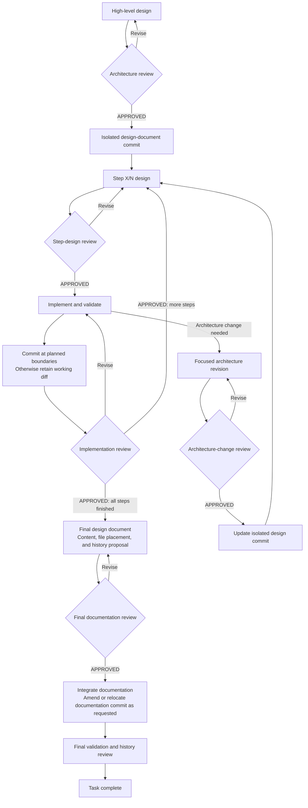

# Human in the Way Review Cycle

Each review gate ends the agent's turn until the user explicitly approves the presented version.
Revision requests stay at the same gate.

```mermaid
flowchart TD
    A[High-level design] --> AR{Architecture review}
    AR -->|Revise| A
    AR -->|APPROVED| D[Isolated design-document commit]
    D --> S[Step X/N design]
    S --> SR{Step-design review}
    SR -->|Revise| S
    SR -->|APPROVED| I[Implement and validate]
    I --> C[Commit at planned boundaries<br/>Otherwise retain working diff]
    C --> IR{Implementation review}
    IR -->|Revise| I
    IR -->|APPROVED: more steps| S
    IR -->|APPROVED: all steps finished| F[Final design document<br/>Content, file placement, and history proposal]
    I -->|Architecture change needed| AC[Focused architecture revision]
    AC --> ACR{Architecture-change review}
    ACR -->|Revise| AC
    ACR -->|APPROVED| U[Update isolated design commit]
    U --> S
    F --> FR{Final documentation review}
    FR -->|Revise| F
    FR -->|APPROVED| H[Integrate documentation<br/>Amend or relocate documentation commit as requested]
    H --> V[Final validation and history review]
    V --> E[Task complete]
```
