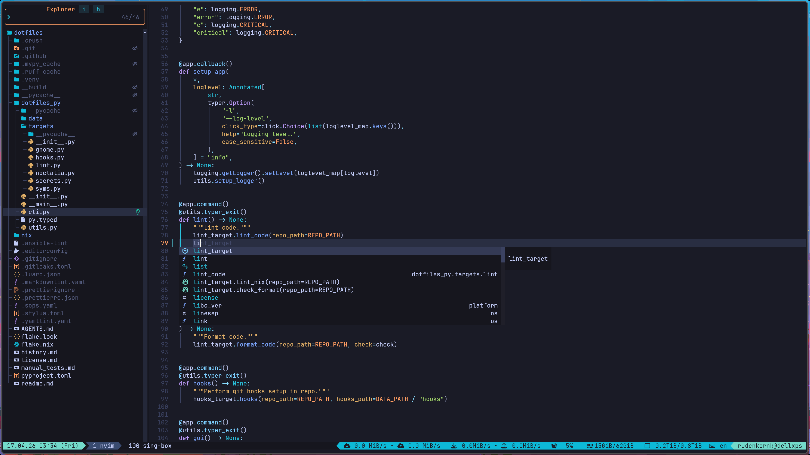
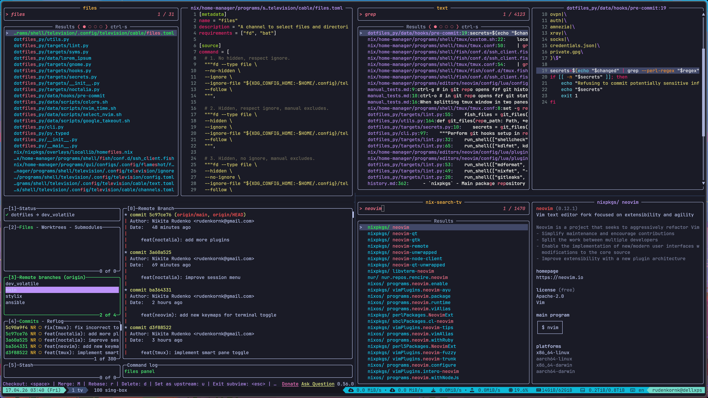
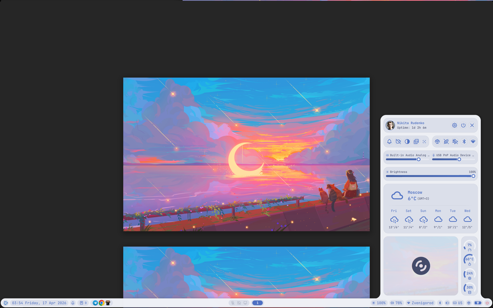

# dotfiles

A `NixOS` configuration.

## Bootstrap

1. In `BIOS`/`UEFI`: disable Secure Boot, enable Setup Mode (also called Audit Mode).

1. Boot live `NixOS` USB.

1. Clone the repo and format disk:

   ```bash
   git clone https://github.com/rudenkornk/dotfiles.git && cd dotfiles
   sudo nix --extra-experimental-features "nix-command flakes" develop .#install
   disko --mode destroy,format,mount --flake .#dellxps
   ```

1. Generate Secure Boot keys and copy them into persistent storage:

   ```bash
   sbctl create-keys
   mkdir -p /mnt/{persistent,}/var/lib/
   cp -r /var/lib/sbctl /mnt/persistent/var/lib/sbctl
   cp -r /var/lib/sbctl /mnt/var/lib/sbctl
   chattr -i /sys/firmware/efi/efivars/{PK,KEK,db}-*
   sbctl enroll-keys --microsoft --firmware-builtin
   ```

1. Install `NixOS` (signs boot files automatically):

   ```bash
   nixos-install --flake .#dellxps --root /mnt
   reboot
   ```

1. In `BIOS`/`UEFI`: enable Secure Boot.

## Showcase





## Features

1. **`NixOS`!**
1. **Stable and reproducible**.
1. **Easily updatable**.
1. **Secrets inside the repo**.
   All the credentials, ssh keys, VPN configs can be stored directly in the repo using
   [`sops`](https://github.com/getsops/sops) and
   [`age`](https://github.com/FiloSottile/age).
   Secret decryption is optional: config works even if secrets are not decrypted.

## Tools

While being decently generic, this config focuses more on some tools rather than others:

1. **`Neovim`**.
   `Neovim` config is based on [`LazyVim`](https://github.com/LazyVim/LazyVim).
   It follows all its guidelines and documentation adding tons of useful plugins on top,
   while still being "blazingly fast", thanks to lazy-loading.
1. **`tmux`**.
   `tmux` integrates with `Neovim`, which allows to seamlessly use keys for moving around and resizing windows.
1. **`fish`**.
   Main shell in this config is `fish`, which integrates with interactive `fzf`, `ripgrep` and `bat`.
   There is some support for `bash` though.
1. **`C++`**.
   Config provides releases of `cmake`, `LLVM` and `GCC` toolchains as well as editor support.
1. Config also provides some support for **`Python`**, **`LaTeX`** and **`Lua`**.

## Maintenance

### Apply new system config

```bash
nh os switch .
```

### Apply only home-manager config part

```bash
nh home switch . -b $(date '+%y.%m.%d-%H.%M')
```

### System recovery from live USB

```bash
git clone https://github.com/rudenkornk/dotfiles.git && cd dotfiles
sudo nix --extra-experimental-features "nix-command flakes" develop .#install
disko --mode mount --flake .#dellxps
nixos-install --flake .#dellxps --root /mnt
reboot
```

## Test

```bash
nix develop
dotfiles format --check
dotfiles lint
```

## Installing standalone packages

Some packages are not included into main config due to their volatile and restricted availability.
To install them run:

```bash
sops --decrypt nix/secrets/corp/packages_info.sops.json | sponge nix/secrets/corp/packages_info.sops.json
nix profile add .#<pkg>
git checkout nix/secrets/corp/packages_info.json
```
